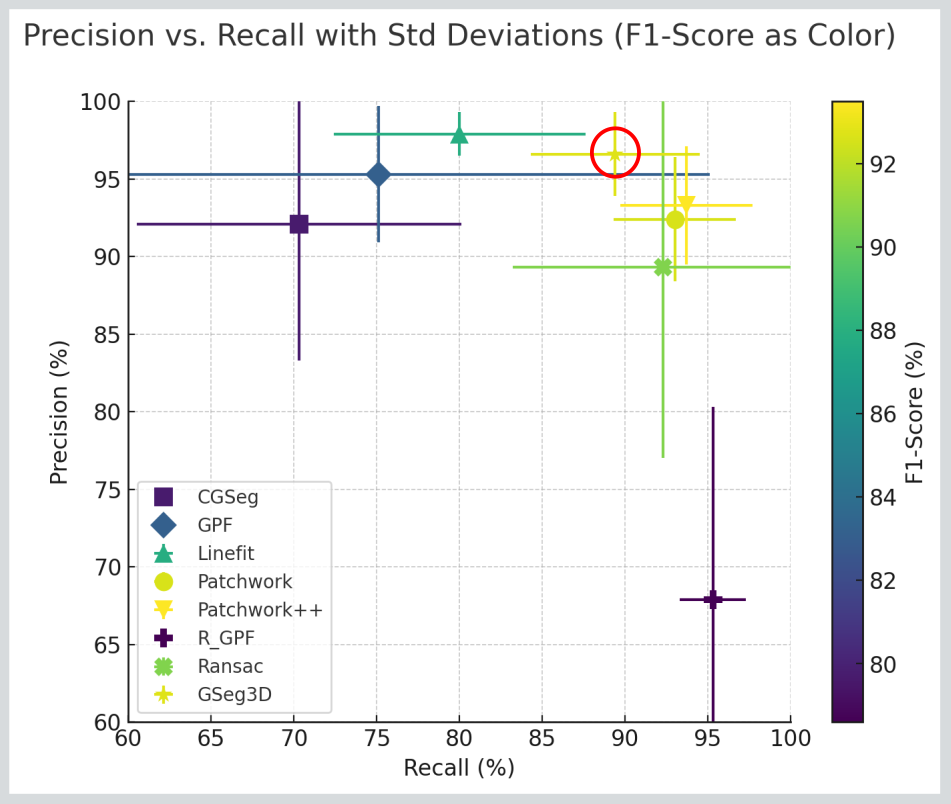

# GSeg3D  
**High-Precision Grid-Based Ground Segmentation for Safety-Critical Autonomous Driving and Robotics Applications**

This module implements the core algorithmic components of **GSeg3D**, a high-precision, grid-based ground segmentation method for LiDAR point clouds designed for **safety-critical autonomous driving and robotics applications**.  
It follows the methodology described in the paper:

> **GSeg3D: A High-Precision Grid-Based Algorithm for Safety-Critical Ground Segmentation in LiDAR Point Clouds**  
> Muhammad Haider Khan Lodhi and Christoph Hertzberg  
> *Proceedings of the 7th International Conference on Robotics and Computer Vision (ICRCV)*,  
> Hong Kong, China, October 24–26, 2025.  
> IEEE, 2025.  
> DOI: https://doi.org/10.1109/ICRCV67407.2025.11349133

This demo video uses the [SemanticKITTI](https://www.semantic-kitti.org/index.html) dataset for evaluation and visualization.


Please find below a summary comparison of the average results on the SemanticKITTI sequences 00–10:


## ROS2

The official ROS 2 wrapper for **GSeg3D** is available here:

[ROS 2 Node Implementation](https://github.com/dfki-ric/ground_segmentation_ros2)

## Motivation

Reliable ground segmentation is a fundamental prerequisite for:
- Obstacle detection
- Traversability estimation
- Navigation and planning
- Mapping and localization

False positives (classifying ground as obstacles) can directly compromise safety and downstream decision-making.  
GSeg3D is explicitly designed to **maximize precision while maintaining robust recall**, even in cluttered and unstructured environments.

## Algorithm Overview

GSeg3D performs **two-phase grid-based ground segmentation**:

### Phase I – Coarse Segmentation
- Uses **larger vertical grid cells**
- Aggressively captures elevated structures as non-ground
- Ensures high initial precision
- May temporarily over-segment ground in cluttered areas

### Phase II – Refinement
- Uses **smaller vertical grid cells**
- Re-evaluates ground points from Phase I
- Corrects false positives and false negatives from Phase I
- Enforces vertical consistency constraints

This dual-phase strategy achieves a strong balance between **precision and recall**, which is critical for safety-critical systems.


## Processing Pipeline

Each phase follows the same four core steps:

1. **Grid Representation**
   - The point cloud is discretized into a regular 3D grid
   - Each point is assigned to a cell based on configurable cell sizes

2. **Local Eigen Classification**
   - Per-cell covariance matrix and eigen decomposition
   - Cells classified as:
     - `LINE` (dominant linear structure)
     - `PLANE` (surface-like structure)
     - `NOISE` (scattered points)

3. **Surface Gradient Analysis**
   - Robust plane fitting using **PCL SACSegmentation (PROSAC)**
   - Slope estimation relative to gravity (world frame)
   - Planar cells exceeding slope thresholds are rejected as ground

4. **Ground Region Expansion**
   - Candidate ground cell centroids are indexed using a **KD-tree (nanoflann)**
   - Radius-based neighborhood expansion ensures connectivity
   - Works even when grid resolution is finer than LiDAR scan-line spacing
   - Phase II additionally enforces height-difference constraints

## Key Design Contributions

### KD-Tree–Based Ground Expansion
Traditional grid-neighbor expansion fails at high grid resolutions due to scan-line gaps.  
GSeg3D overcomes this by:
- Indexing ground centroids in a KD-tree
- Performing radius-based spatial expansion
- Enabling fine grid resolutions without loss of connectivity or recall

### Robust Seed Initialization
- Synthetic seed points are injected directly beneath the robot
- Ensures reliable ground initialization even with occlusions or sparse data
- Synthetic points are removed before final output and evaluation

### Multi-Step Ground Verification
Each candidate cell undergoes:
- Plane inlier / outlier separation
- Bounding-box sparsity analysis
- Neighborhood height consistency checks
- Floating-cell rejection (non-ground below)

Only physically plausible and spatially coherent cells are labeled as ground.


## Implementation Details

To generate the HTML documentation for this library:

### System Requirements

OS: Ubuntu 22.04, Ubuntu 24.04

### Dependencies

- CMake
- PCL  
- Eigen3  
- GoogleTest  
- NanoFlann
- JDK 17

Example (Ubuntu):

```bash
sudo apt update
sudo apt install cmake libpcl-dev libeigen3-dev libgtest-dev libnanoflann-dev openjdk-17-jre
```

### Build Instructions

```bash
git clone git@github.com:dfki-ric/ground_segmentation.git
cd ground_segmentation && mkdir -p build
cd build
cmake .. -DCMAKE_BUILD_TYPE=RELEASE
make
```

### Generating Documentation

1. Make sure you have **Doxygen** and **Graphviz** installed:

```bash
sudo apt install doxygen graphviz
```

2. From the root of the project, run CMake and build the `doc` target:

```bash
cmake --build . --target doc
```

3. After building, open the generated HTML documentation `doc/html/index.html` in your browser

> The main page will include the README and automatically list the header files and classes.

### Running Unit Tests

```bash
ctest --test-dir test/ --output-on-failure
```

or

```bash
./test/test_pointcloud_grid
```

### Visual Ground Segmentation Tool

```bash
./test/test_visual_segmentation <cloud.pcd|cloud.ply> [cell_size] [slope_deg] [dist_to_ground]
```

#### Example

```bash
wget https://zenodo.org/records/13771864/files/utah.ply
./test/test_visual_segmentation utah.ply 1.0 30 -0.5
```

#### Colour Coding

- Green → Ground points  
- Red → Obstacles / non-ground points  

Close the viewer window to exit.

### Core Class

```cpp
template<typename PointT>
class PointCloudGrid;
```

### Main API

```cpp
PointCloudGrid(const GridConfig& config);

void setInputCloud(
    pcl::PointCloud<PointT>::Ptr input,
    const Eigen::Quaterniond& R_body2World
);

std::pair<
    pcl::PointCloud<PointT>::Ptr,
    pcl::PointCloud<PointT>::Ptr
> segmentPoints();
```

## Typical Configuration 
Below is a recommended baseline setup for most outdoor mobile robotics use cases (e.g., LiDAR-based UGVs). Adjust values based on sensor height, terrain roughness, and map resolution.

Phase-I
```yaml
cellSizeX: 1.0
cellSizeY: 1.0
cellSizeZ: 10.0   # Phase I
slopeThresholdDegrees: 20.0
groundInlierThreshold: 0.125
centroidSearchRadius: 5.0
distToGround: -1.723 # (e.g. SemanticKITTI)
maxGroundHeightDeviation: 0.1
```
Phase-II

After coarse ground detection of Phase-I, Phase II increases vertical resolution to refine classification. All parameters are kept same as Phase-I expect for the `cellSizeZ`
```
cellSizeZ: 1.0
```

## Performance Summary (SemanticKITTI)

- **Precision:** ~96–99% (low variance)
- **Recall:** ~85–91%
- **F1-score:** ~92–94%
- **Runtime:** ~48 ms (CPU, single scan average)

GSeg3D consistently demonstrates **stable, high-precision performance** across:
- Urban environments
- Highways
- Unstructured terrain

## Intended Use

- Safety-critical autonomous driving
- Outdoor mobile robotics
- Traversability analysis
- Mapping and perception pipelines

## Notes & Future Work

- Recall degradation in dense vegetation remains challenging
- Planned extensions:
  - Semantic-aware refinement
  - Temporal fusion
  - GPU acceleration

## Tests & Visualisation

This directory contains **unit tests** and a **visual debugging tool** for the
`PointCloudGrid` ground segmentation implementation.

The code uses **PCL**, **Eigen**, and **GoogleTest** and is intended for quick
validation of grid indexing, ground classification logic, and phase-based
segmentation behaviour.

### Contents

- `test_pointcloud_grid.cpp`  
  GoogleTest-based **unit tests** covering:
  - Grid indexing and hashing
  - Flat ground detection
  - Vertical structures as obstacles
  - Phase 1 vs Phase 2 behaviour
  - Orientation / gravity influence
  - Robustness against empty inputs

- `test_visual_segmentation.cpp`  
  A **visual inspection tool** that:
  - Loads a `.pcd` or `.ply` point cloud
  - Runs **phase 1 + phase 2** ground segmentation
  - Displays ground (green) and obstacles (red) using PCLVisualizer

### Notes

- Phase 1 allows vertical and slanted propagation from the robot seed cell.
- Phase 2 refines ground classification using only previously detected ground.
- Orientation (`Eigen::Quaterniond`) is interpreted as sensor → world rotation.

## License

BSD-3 Clause License.

## Citation

If you use this work, please cite:

Muhammad Haider Khan Lodhi and Christoph Hertzberg, "GSeg3D: A High-Precision Grid-Based Algorithm for Safety-Critical Ground Segmentation in LiDAR Point Clouds" in *2025 7th International Conference on Robotics and Computer Vision (ICRCV)*, pp. 119-126, 2025. doi: [10.1109/ICRCV67407.2025.11349133](https://doi.org/10.1109/ICRCV67407.2025.11349133)


© DFKI Robotics Innovation Center
